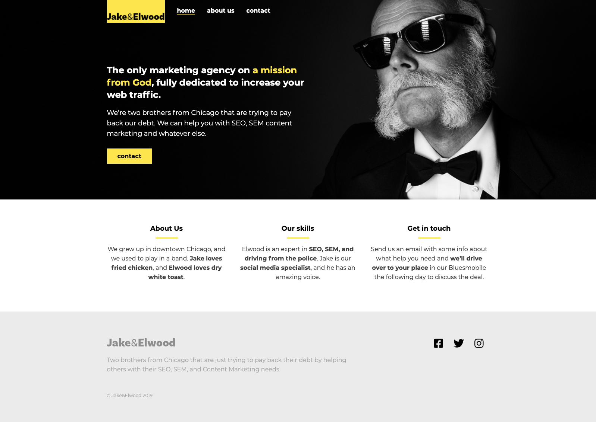
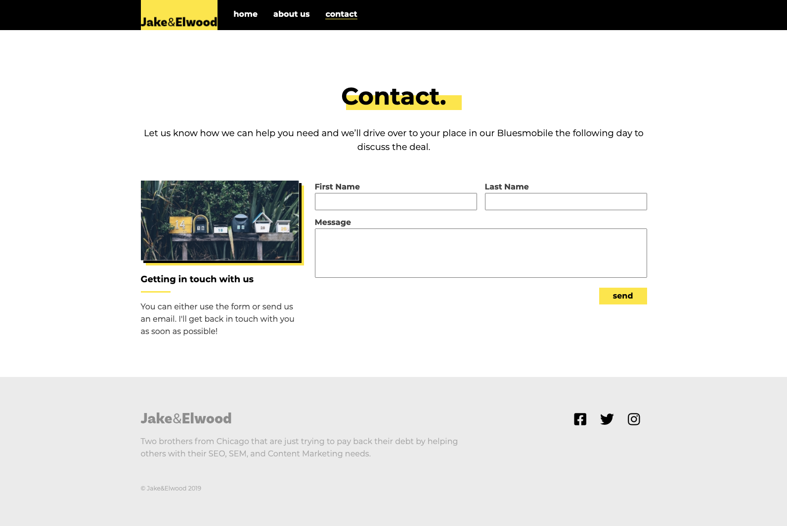
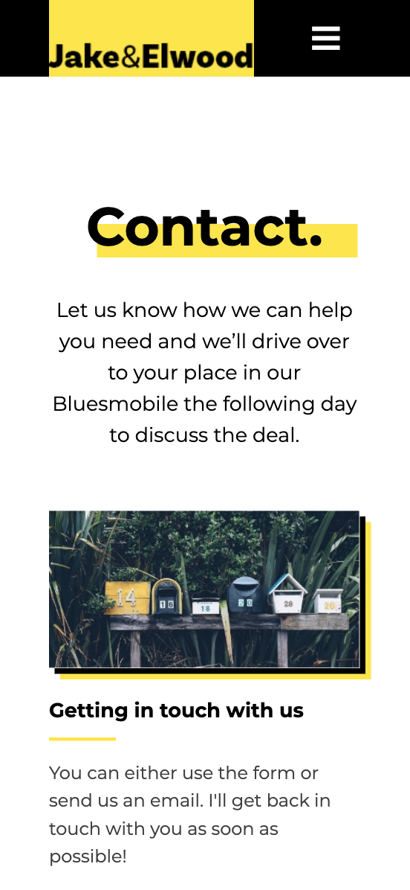
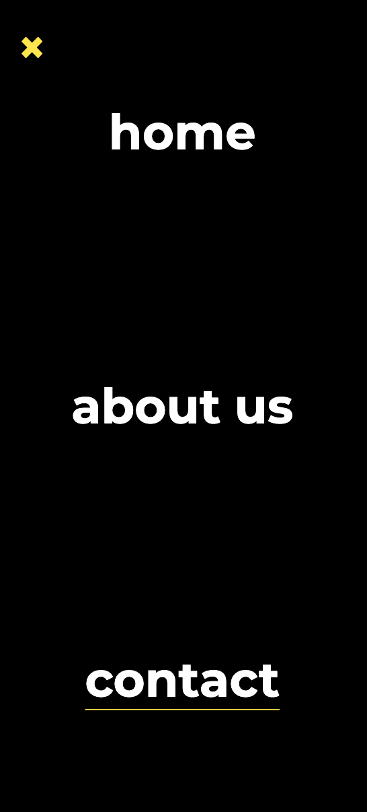

# Marketing Agency Website

This is a final project from [Scrimba's Responsive Web Design Bootcamp](https://scrimba.com/learn/responsive), thus the main focus of this project is CSS and responsiveness.

## Table of contents

- [Overview](#overview)
  - [Screenshots](#screenshots
  - [Links](#links)
- [My process](#my-process)
  - [Built with](#built-with)
- [Author](#author)

## Overview

### Screenshots

### Links

- [Live Site URL](https://miri52.github.io/scrimba-responsive-bootcamp-final-project/)

## My process

### Built with

- Mobile-first workflow
- Media queries
- Grid

## Author

- LinkedIn - [Miriama Svítková](https://www.linkedin.com/in/miriama-svitkova)
